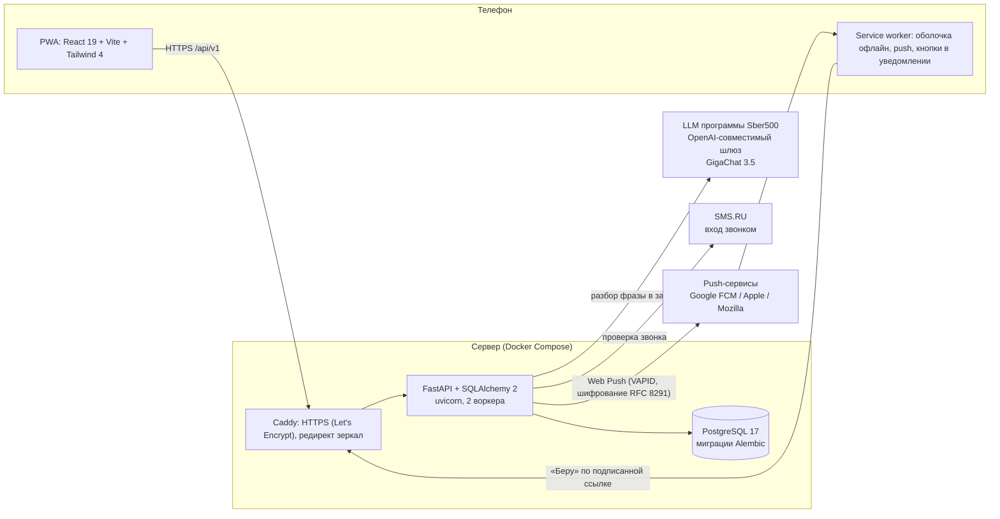
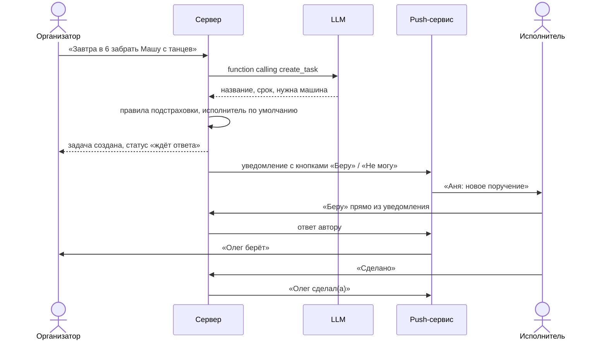

# Архитектура

Как устроен «Семейный диспетчер» сейчас: компоненты, потоки данных, развёртывание, наблюдаемость.
Подробности по коду и API — [web-mvp.md](web-mvp.md).

## Принципы

1. **LLM понимает язык, но не принимает решений за семью.** Модель превращает фразу «завтра в 6 забрать Машу с танцев» в структурированную задачу (function calling `create_task`). Кому достанется задача, решают простые правила: второй взрослый, для поездок — тот, у кого машина. Назначение предсказуемо, и его всегда можно поменять в один тап.
2. **Продукт не ломается без внешних сервисов.** Нет LLM — задачу разбирают правила. Нет VAPID-ключей — нет push, остальное работает. Нет ключа SMS.RU — вход в разработке подтверждается сразу (в продакшне запрещено).
3. **Каждое обращение к компоненту учитывается.** Вызовы LLM, push, входа по телефону и будущих каналов пишутся в `component_calls` — это «обращения» по Положению программы и основа расчёта стоимости LLM на DAU.

## Схема



## Главный сценарий: «Поручила — сделано»



## Компоненты

| Компонент | Технология | Ответственность |
|---|---|---|
| Клиент | React 19, TypeScript, Vite, Tailwind 4, PWA | Вход, лента дел, ответы на поручения, подключение уведомлений |
| Service worker | `web/public/sw.js` | Офлайн-оболочка, показ push, действия из уведомления |
| API | FastAPI, Pydantic v2, SQLAlchemy 2 | Аккаунты, семьи, задачи, push, аналитика |
| Разбор задач | `task_extractor.py` + `llm_client.py` | Фраза → `TaskDraft`; LLM + правила (сроки, срочность, повторы, поездки) |
| Поручения | `family_service.py` | Исполнитель по умолчанию, статусы new → accepted → done, повторы |
| Уведомления | `notifications.py`, pywebpush | Тексты, подписанные ссылки, доставка в фоне, чистка мёртвых подписок |
| Вход | `phone_auth.py` | SMS.RU callcheck, лимиты попыток, одноразовая выдача сессии |
| Учёт обращений | `telemetry.py` | Журнал вызовов компонентов: тип, длительность, статус, токены, модель |
| База | PostgreSQL 17 | Все данные; схема — миграции Alembic |
| Веб-сервер | Caddy 2 | TLS, HTTP/2, сжатие, редирект `.ru` и `www` на основной адрес |

## Развёртывание

- **Сервер:** VPS в России (Timeweb Cloud, Новосибирск; 2 vCPU, 4 ГБ RAM, 50 ГБ NVMe). Доступ только по SSH-ключу.
- **Домены:** основной — семейныйдиспетчер.рф; semeinidispetcher.ru и `www` перенаправляют на него (вход и подписка на уведомления привязаны к адресу сайта).
- **Сборка:** многоэтапный `Dockerfile` — Node собирает клиент, Python-образ запускает `alembic upgrade head`, затем uvicorn. Приложение работает от непривилегированного пользователя.
- **Состав** `docker-compose.yml`: `app`, `db` (PostgreSQL с проверкой готовности), `caddy`.
- **Секреты** — только в `.env` на сервере (шаблон — [.env.example](../.env.example)); ключи push генерирует `deploy/gen_keys.py` на самом сервере.
- **Выкатка:**

```bash
cd /opt/family-dispatcher
docker compose exec -T db pg_dump -U family_dispatcher family_dispatcher | gzip > /root/backup_$(date +%Y%m%d_%H%M).sql.gz
git pull
docker compose up -d --build
```

## Наблюдаемость

- **Метрики продукта:** `GET /api/v1/analytics/daily` — DAU, действия на DAU, обращения к компонентам на DAU, ошибки компонентов по дням; CSV-выгрузки событий и обращений с обезличенными идентификаторами.
- **Метрики компонентов:** у каждого обращения — длительность (`latency_ms`), статус и код ошибки, токены и модель для LLM. Из них считаются стоимость LLM на DAU и доля ошибок.
- **Логи:** uvicorn и Caddy пишут в stdout контейнеров — `docker compose logs app caddy`.

## Безопасность и персональные данные

- Данные хранятся на сервере в России; передача — только по HTTPS.
- Вход без паролей: подтверждение номера звонком; лимиты попыток на номер и IP; сессия по одной проверке выдаётся один раз.
- Ссылки действий из уведомлений подписаны HMAC и истекают через 7 дней; содержимое push зашифровано.
- Согласие на обработку персональных данных — на экране входа, [политика конфиденциальности](../web/public/privacy.html) — `/privacy.html`.
- Данные респондентов интервью в репозиторий не попадают.

## Что дальше

| Компонент | Зачем |
|---|---|
| Фоновый воркер напоминаний и эскалации | Напомнить, если исполнитель не ответил или срок прошёл; вернуть задачу автору |
| Боты ВКонтакте и Telegram, почта | Дополнительные каналы с выбором на участника — без дублей на каждую задачу |
| Серверное распознавание речи (whisper в инфраструктуре программы) | Голос без передачи в сервисы браузера |
| Дневной лимит расходов на LLM | Защита бюджета программы |
